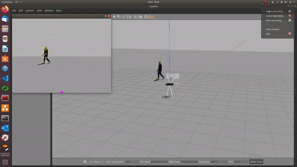

# Drone_sim on Gazebo
---
## Introuction

Gazebo simulation of Parrot drone performing human continous tracking using Openpose powered by ROS 

Skills Summary:
- ROS
- Gazebo simulator
- Machine Learning
- Computer Vision (Perception)
- OOP programming
- Innovative Prototyping

---
## Env
1. ./env.sh
2. rosrun pysdf sdf2urdf.py sjtu_drone.sdf sjtu_drone.urdf
------
## Run
1. ./run_gazebo.sh
2. ./run_script.sh
---
## Results

1. NVIDIA TRT Pose estimation 

2. OpenCV Openpose

---
## Reference
1. https://github.com/NVIDIA-AI-IOT/trt_pose
2. https://github.com/tahsinkose/sjtu-drone
3. https://github.com/tahsinkose/openai-ros-gazebo-workout

---
# Appendix
---
## Sprint Presentation
- [Gazebo & ROS Openpose](./Gazebo%20and%20ROS%20presentation.pdf)
- [ROS Gazebo Quadrotor](./ROS_Gazebo_Quadrotor_simulator.pdf)
---
## Commits
|Commit Abbreviation | Description |
|-------------|---------------------------|
|INIT:        | Initialised a file
|MOD:         | Modified a function or something. |
|ADD:         | Added a function or an aspect of something. |
|FIX:         | A quick little fix. |
|DEL:         | Deleted something. |
|[NOT TESTED] | Flag for if it hasn't been tested. |
